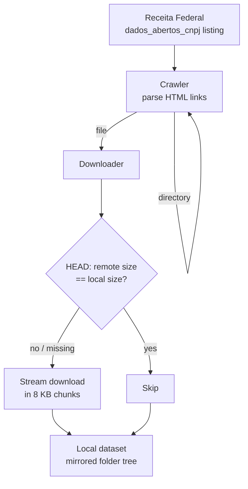

<div align="center">


[](https://github.com/fabricioguidine/cnpj-downloader/actions/workflows/ci.yml) [](https://www.python.org/downloads/) [](LICENSE) [](https://github.com/astral-sh/ruff) [](#requirements)

</div>

> Bulk downloader for Brazil's public CNPJ dataset (Receita Federal), with size-based skip and re-download of incomplete files.

`cnpj-downloader` recursively crawls the Receita Federal open-data directory listing for the CNPJ dataset, mirroring its monthly folder structure to disk. It uses only `requests` and `BeautifulSoup` (no browser automation): it parses each HTML directory page for links, descends into subdirectories, and downloads every file it finds. Before each download it issues a `HEAD` request and compares `Content-Length` against the local file, skipping files already present at the expected size and re-downloading anything missing or incomplete. Per-file timing and average speed are reported as it runs.

## Table of Contents

- [Features](#features)
- [How it works](#how-it-works)
- [Requirements](#requirements)
- [Installation](#installation)
- [Usage](#usage)
- [Configuration](#configuration)
- [Project structure](#project-structure)
- [License](#license)

## Features

- **Recursive crawling** — walks the entire directory listing, descending into every monthly subfolder.
- **Structure preservation** — recreates the source folder hierarchy under the local output directory.
- **Size-based skip** — issues a `HEAD` request and skips files whose local size already matches the remote `Content-Length`.
- **Incomplete-file recovery** — files whose local size does not match the remote size are re-downloaded from scratch on the next run.
- **Progress and speed reporting** — prints per-file duration, throughput (MB/s), and a rolling average-speed estimate.
- **Streamed downloads** — writes in 8 KB chunks so large files do not need to fit in memory; partial files are removed on error.
- **Lightweight** — depends only on `requests` and `beautifulsoup4`.

## How it works



The `Manager` starts at the configured base URL and asks the `Crawler` for the links on that page. Each link ending in `/` is treated as a directory and crawled recursively; every other link is treated as a file and handed to the `Downloader`. The `Downloader` performs a `HEAD` request to learn the remote size, compares it to any existing local file, and either skips it or streams it to disk, reporting timing and speed via the helpers in `utils`.

## Requirements

- Python 3.8 or higher
- Internet connection
- Sufficient disk space for the CNPJ dataset (tens of GB when fully mirrored)

Runtime dependencies: `requests`, `beautifulsoup4`.

## Installation

```powershell
git clone https://github.com/fabricioguidine/cnpj-downloader.git
cd cnpj-downloader

# Runtime dependencies only
pip install -r requirements.txt
```

Or install the package (exposes the `cnpj-downloader` console command):

```powershell
pip install -e .
```

For development (linting, type-checking, tests):

```powershell
pip install -e ".[dev]"
```

## Usage

Run with the default Receita Federal base URL and `data/` output directory:

```powershell
python main.py
```

If installed as a package, use the console entry point instead:

```powershell
cnpj-downloader
```

### Output directory

The output directory is read from the `CNPJ_OUTPUT_DIR` environment variable (default: `data`):

```powershell
$env:CNPJ_OUTPUT_DIR = "D:\cnpj-data"
python main.py
```

### Programmatic use

```python
from src.manager import CNPJDownloaderManager

manager = CNPJDownloaderManager(
    base_url="https://arquivos.receitafederal.gov.br/dados/cnpj/dados_abertos_cnpj/",
    output_dir="custom_data_dir",
)
manager.run()
```

Re-running the tool is safe and incremental: already-complete files are skipped, new monthly folders are picked up automatically, and incomplete files are re-downloaded.

## Configuration

Settings live in [`src/config.py`](src/config.py):

| Setting | Description | Default |
|---|---|---|
| `BASE_URL` | Directory listing to crawl | Receita Federal `dados_abertos_cnpj/` |
| `OUTPUT_DIR` | Output directory (env `CNPJ_OUTPUT_DIR`) | `data` |
| `REQUEST_TIMEOUT` | Timeout for listing requests (s) | `15` |
| `HEAD_TIMEOUT` | Timeout for `HEAD` size checks (s) | `10` |
| `CHUNK_SIZE` | Streaming chunk size (bytes) | `8192` |

## Project structure

```
cnpj-downloader/
├── main.py              # Entry point
├── src/
│   ├── config.py        # Base URL, output dir, timeouts, chunk size
│   ├── crawler.py       # HTML link discovery (requests + BeautifulSoup)
│   ├── downloader.py    # HEAD size check, streamed download, skip logic
│   ├── manager.py       # Recursive crawl-and-download orchestration
│   └── utils.py         # Speed/time/size formatting helpers
├── tests/               # pytest suite
├── data/                # Downloaded dataset (git-ignored)
├── requirements.txt     # Runtime dependencies
├── pyproject.toml       # Build, lint, test configuration
└── setup.py             # Package setup
```

## License

Released under the [MIT License](LICENSE).
