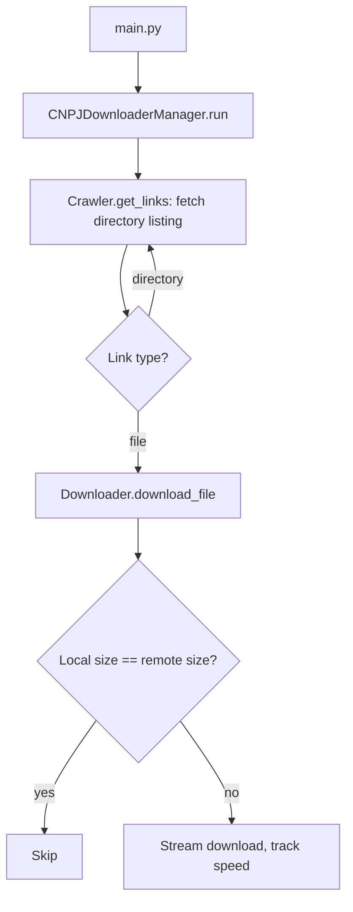

# cnpj-downloader

Recursively crawls the Receita Federal open-data portal and downloads the Brazilian CNPJ company-registration datasets, preserving the remote folder structure.

[](https://github.com/fabricioguidine/cnpj-downloader/actions/workflows/ci.yml) [](https://www.python.org/downloads/) [](LICENSE)

The Receita Federal publishes the CNPJ open data at [arquivos.receitafederal.gov.br](https://arquivos.receitafederal.gov.br/dados/cnpj/dados_abertos_cnpj/), typically adding a new monthly folder (e.g. `2025-07/`). This tool walks those directory listings, downloads every file it finds, and skips files already present locally with a matching size, so re-running it picks up only new or incomplete data.

## Features

- **Recursive crawling** — walks every monthly directory and subdirectory from the base URL.
- **Skip on match** — files whose local size equals the remote `Content-Length` are skipped.
- **Re-download on mismatch** — incomplete or size-mismatched files are downloaded again; partial files left by an interrupted run are removed and refetched on the next run.
- **Progress tracking** — reports per-file size, duration, speed, and a running average-speed estimate.
- **Structure preservation** — local files mirror the remote folder hierarchy.
- **Lightweight** — uses only `requests` and `beautifulsoup4`; no browser automation.

## Requirements

- Python 3.8+
- `requests`, `beautifulsoup4`
- Internet access and enough disk space for the datasets (they are large)

## Installation

```bash
git clone https://github.com/fabricioguidine/cnpj-downloader.git
cd cnpj-downloader
pip install -r requirements.txt
```

Or install as a package (exposes a `cnpj-downloader` console script):

```bash
pip install .
# or, for development:
pip install -e ".[dev]"
```

## Usage

Run with defaults (downloads into `data/`):

```bash
python main.py
```

Override the output directory via environment variable:

```bash
export CNPJ_OUTPUT_DIR=/path/to/data
python main.py
```

If installed as a package, the console script is equivalent:

```bash
cnpj-downloader
```

Programmatic use:

```python
from src.manager import CNPJDownloaderManager

manager = CNPJDownloaderManager(
    base_url="https://arquivos.receitafederal.gov.br/dados/cnpj/dados_abertos_cnpj/",
    output_dir="custom_data_dir",
)
manager.run()
```

## Configuration

Settings live in `src/config.py`. The output directory can be set via the `CNPJ_OUTPUT_DIR` environment variable; the rest are edited in the file.

| Setting | Description | Default |
|---|---|---|
| `CNPJ_OUTPUT_DIR` (env) / `OUTPUT_DIR` | Directory for downloaded files | `data` |
| `BASE_URL` | Receita Federal CNPJ open-data URL | `.../dados_abertos_cnpj/` |
| `REQUEST_TIMEOUT` | Timeout for directory-listing requests (s) | `15` |
| `HEAD_TIMEOUT` | Timeout for remote-size HEAD requests (s) | `10` |
| `CHUNK_SIZE` | Streaming download chunk size (bytes) | `8192` |

## Flow



## Project structure

```
cnpj-downloader/
├── src/
│   ├── __init__.py     # Package metadata
│   ├── config.py       # Base URL, output dir, timeouts, chunk size
│   ├── crawler.py      # Directory-listing crawler (requests + BeautifulSoup)
│   ├── downloader.py   # File download, size check, progress tracking
│   ├── manager.py      # Recursive crawl-and-download orchestration
│   └── utils.py        # Time/size formatting and average-speed helpers
├── tests/              # pytest suite
├── data/               # Downloaded files (git-ignored)
├── main.py             # Entry point
├── pyproject.toml      # Build config, deps, ruff/mypy/pytest settings
├── setup.py            # Packaging
└── requirements.txt
```

## Testing

```bash
pip install -e ".[dev]"
pytest --cov=src --cov-report=term-missing
```

Linting and type checks (as run in CI):

```bash
ruff check .
ruff format --check .
mypy src
```

## License

MIT — see [LICENSE](LICENSE).
